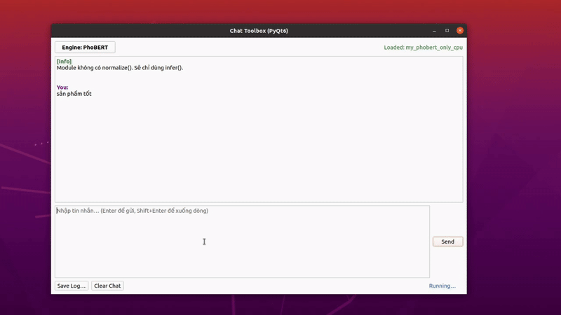
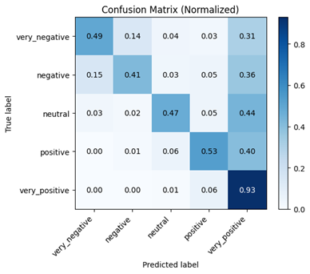
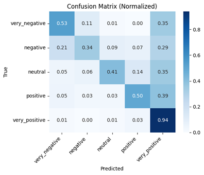
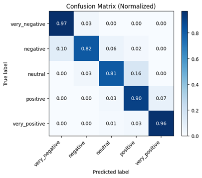
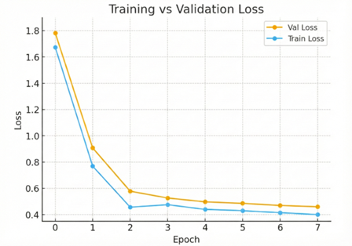

# Hệ thống phân tích cảm xúc tiếng Việt ứng dụng cho bình luận trên sàn thương mại điện tử

Phân tích cảm xúc theo 5 mức độ: `very_negative` · `negative` · `neutral` · `positive` · `very_positive`

<p align="center">
  
</p>

---

## Cài đặt

```bash
git clone https://github.com/Tientmn/nlp_nckh.git
cd nlp_nckh
```

### Môi trường cho TF-IDF & PhoBERT (Python 3.10)

```bash
conda create -n nlp_phobert python=3.10
conda activate nlp_phobert
pip install -r requirements310.txt
```

### Môi trường cho BiLSTM (Python 3.11)

```bash
conda create -n nlp_tf python=3.11
conda activate nlp_tf
pip install tensorflow pandas scikit-learn numpy matplotlib joblib
```

---

## Cấu trúc thư mục

```
nlp_nckh/
├── data/
│   ├── train/train.csv       # tập huấn luyện (cột: text, label)
│   └── test/test.csv         # tập kiểm tra
├── tfidf/
│   ├── train_tfidf_baseline.py
│   ├── test_tfidf.ipynb
│   └── bendmark_tfidf.ipynb
├── bilstm/
│   ├── train_bilstm_sentiment_multiclass.py
│   ├── predict_sentiment.ipynb
│   └── bilstm_vn_sentiment.pt
├── phobert/
│   ├── train_phobert_5cls.py
│   ├── chat_toolbox.py       # GUI chính
│   ├── my_phobert_only.py    # backend GPU
│   ├── my_phobert_only_cpu.py
│   └── textproc.py
├── llm/
│   ├── classify_csv_llm.py
│   └── test_llm.ipynb
├── media/                    # ảnh minh họa
├── output/
│   └── training_log.csv
├── requirements310.txt       # TF-IDF & PhoBERT
└── requirements38.txt
```

---

## Dữ liệu

Một phần dữ liệu lấy từ [ViMRHP](https://github.com/trng28/ViMRHP).

---

## Training

### TF-IDF

```bash
conda activate nlp_phobert
python tfidf/train_tfidf_baseline.py
```

Model được lưu tại `tfidf/tfidf_baseline.joblib`.

### BiLSTM

```bash
conda activate nlp_tf
python bilstm/train_bilstm_sentiment_multiclass.py
```

Model được lưu tại `bilstm/bilstm_vn_sentiment_5cls/`.

### PhoBERT

```bash
conda activate nlp_phobert
python phobert/train_phobert_5cls.py
```

---

## Inference

### TF-IDF (Jupyter)

Tải model đã train tại [Google Drive](https://drive.google.com/drive/folders/1sHsoVpL0uFNMRFyT0DUz1HRFUScmU4hp?usp=drive_link), giải nén rồi cập nhật đường dẫn trong notebook:

```python
MODEL_PATH = Path("tfidf_baseline.joblib")
```

Mở `tfidf/test_tfidf.ipynb`.

### BiLSTM (Jupyter)

Tải model tại [Google Drive](https://drive.google.com/drive/folders/1sHsoVpL0uFNMRFyT0DUz1HRFUScmU4hp?usp=drive_link), giải nén rồi cập nhật đường dẫn trong notebook:

```python
MODEL_DIR = "bilstm/bilstm_vn_sentiment_5cls"
```

Mở `bilstm/predict_sentiment.ipynb`.

### PhoBERT với GUI

Tải model tại [Google Drive](https://drive.google.com/drive/folders/1sHsoVpL0uFNMRFyT0DUz1HRFUScmU4hp?usp=drive_link), giải nén rồi cập nhật đường dẫn trong `phobert/my_phobert_only_cpu.py` (CPU) hoặc `phobert/my_phobert_only.py` (GPU):

```python
_DEF_CANDIDATES: List[str] = [
    os.environ.get("PHOBERT_MODEL_DIR", ""),
    "/path/to/phobert_5cls_clean",   # đổi thành đường dẫn thực
]
```

Chọn module trong `phobert/chat_toolbox.py`:

```python
mod_name = os.environ.get("CHAT_TOOLBOX_PHOBERT_MODULE", "my_phobert_only_cpu")  # hoặc my_phobert_only
```

Chạy GUI:

```bash
conda activate nlp_phobert
cd phobert
python chat_toolbox.py
```

### Local LLM

Kéo model từ Ollama:

```bash
ollama pull <model_name>
```

Cập nhật `MODEL_NAME` trong `llm/test_llm.ipynb` rồi chạy notebook.

---

## Kết quả

### TF-IDF + Logistic Regression / LinearSVC

<p align="center">
  
</p>

### BiLSTM

<p align="center">
  
</p>

### PhoBERT

<p align="center">
  
</p>
<p align="center">
  
</p>
